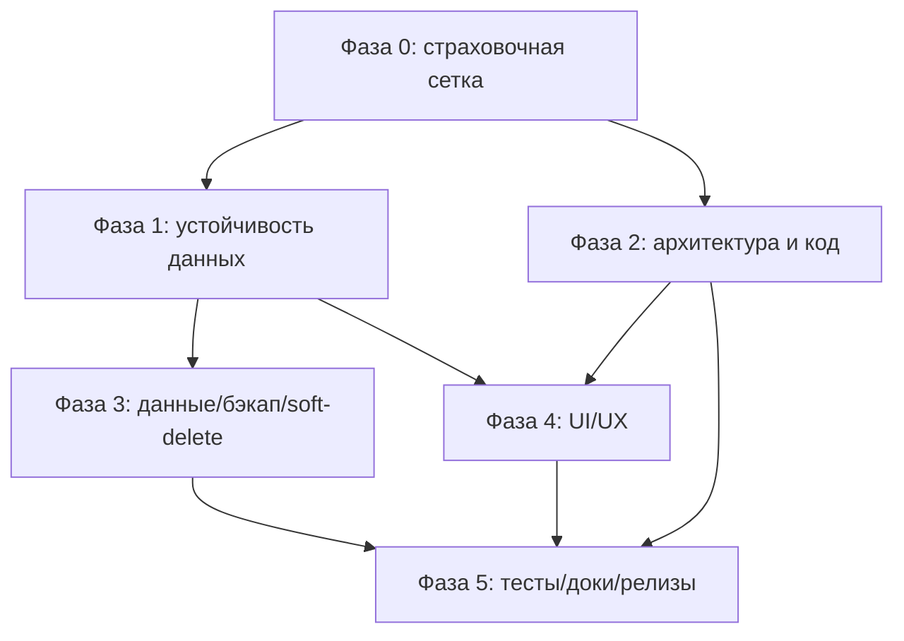

# REFACTORING_PLAN — План безопасного рефакторинга «Калькулятор инфраструктуры»

> Дата: 2026-06-13. Документ — **план**, не рефакторинг. Код в ходе подготовки плана не менялся.
> Доказательная база и реестр находок — [AUDIT_NOTES.md](AUDIT_NOTES.md). Каждая задача ниже ссылается на ID находки оттуда.
>
> **Жёсткие ограничения плана** (сохраняются при исполнении):
> 1. Стек неизменен: vanilla ES2022, `node:test`, Playwright. **Без** перехода на фреймворки/TypeScript в основном плане (опции вынесены в §8).
> 2. Каждое изменение — под защитой характеризационных/unit/e2e тестов (Фаза 0 — первая).
> 3. Деструктивные изменения данных, миграции, безопасность — отдельные задачи с явным DoD и откатом.
> 4. Git/релизы — не трогаются автоматически; коммит/тег только по явному запросу.

---

## 1. Резюме и стратегия

Проект зрелый (см. AUDIT_NOTES §0): критических дефектов нет, защита данных и XSS на высоком уровне. Поэтому стратегия — **не «большой передел», а точечное усиление**:

1. **Сначала страховочная сетка** (Фаза 0): линтер + type-check + характеризационные guard-тесты + бэкап данных — чтобы любой последующий рефактор был обратим и наблюдаем.
2. **Закрыть две главные устойчивости данных** (Фаза 1): pre-migration бэкап (DATA-1) и авто-бэкап/экспорт (DATA-2).
3. **Снизить долг архитектуры/кода** (Фаза 2): декомпозиция `app.js`/`seed.js`, удаление вестигиального механизма версий.
4. **Формализовать данные** (Фаза 3): backup/restore, опциональный soft-delete, экспорт-всего.
5. **UI/UX-консистентность** (Фаза 4): единый контракт деструктивных действий, узкий viewport.
6. **Тесты/доки/релизы** (Фаза 5): тесты модалок, `SECURITY.md`/`CHANGELOG.md`, релиз-чеклист.

**Принцип очерёдности:** ничего из Фаз 2–5 не начинается до зелёной Фазы 0. Внутри фазы — по приоритету находки.

### Шкала оценок (для полей «Трудоёмкость»)
S ≤ 0.5 дня · M ≈ 1–2 дня · L ≈ 3–5 дней · XL > 5 дней.

---

## 2. Карта зависимостей фаз

Текстом: Фаза 0 — предпосылка для всего. Фаза 1 (данные) и Фаза 2 (код) независимы и могут идти параллельно после Фазы 0. Фаза 3 расширяет Фазу 1. Фаза 4 опирается на Фазы 1+2. Фаза 5 — завершающая.

---

## 3. Фаза 0 — Страховочная сетка (предусловие любого рефактора)

Цель: сделать кодовую базу **наблюдаемой и обратимой** до первой содержательной правки.

### T0.1 · ESLint + Prettier (ENG-1)
- **Цель:** автоматически ловить класс ошибок, который не покрыт тестами (`no-unused-vars`, `eqeqeq`, `no-undef`, `no-shadow`).
- **Шаги:** добавить `eslint.config.js` (flat-config, env browser+node, ES2022, **без** framework/TS-плагинов); добавить `npm run lint`; прогнать в baseline-режиме, зафиксировать текущие нарушения отдельным отчётом, чинить итеративно (не блокировать весь проект сразу — `--max-warnings` поэтапно). Prettier — опционально, как `--check` (не авто-reformat всего разом, чтобы не зашумить git-историю).
- **Приоритет:** Высокий. **Трудоёмкость:** M. **Зависимости:** нет.
- **DoD:** `npm run lint` существует и в CI (`ci.yml`); 0 errors на текущем коде (warnings допускаются с планом устранения).
- **Проверка:** запуск `npm run lint`; добавить шаг в `ci.yml` после `Unit tests`.
- **Риски:** массовые косметические правки зашумят git — митигация: только `error`-правила вначале, форматирование отдельной волной.

### T0.2 · `checkJs` через `jsconfig.json` (ENG-1, типобезопасность)
- **Цель:** включить проверку типов по существующему JSDoc **без миграции на TypeScript**.
- **Шаги:** добавить `jsconfig.json` (`checkJs:true`, `strict`-подмножество, `allowJs`); `npm run typecheck` = `tsc -p jsconfig.json --noEmit` (через `npx`, без добавления TS в runtime); чинить найденные несоответствия точечно.
- **Приоритет:** Средний. **Трудоёмкость:** M→L (зависит от числа JSDoc-несоответствий). **Зависимости:** T0.1 желательно раньше.
- **DoD:** `npm run typecheck` зелёный; шаг в CI.
- **Проверка:** `npm run typecheck`.
- **Риски:** объём найденных проблем заранее неизвестен — митигация: начать с `js/utils` и `js/domain` (чистые модули), расширять по слоям.

### T0.3 · Характеризационные guard-тесты текущего поведения
- **Цель:** зафиксировать наблюдаемое поведение перед рефактором.
- **Шаги:** опереться на существующие golden/roundtrip (`tests/unit/domain/business-golden-scenarios.test.js`, `tests/integration/scenario-persist-roundtrip.test.js`); добавить недостающие «снимки» итогов для 3–5 эталонных расчётов (totalMonthly/Annual/byStand/topCategory) и bundle import↔export roundtrip; зафиксировать как baseline.
- **Приоритет:** Высокий. **Трудоёмкость:** M. **Зависимости:** нет.
- **DoD:** новые golden-тесты зелёные и описаны в `MAINTAINER_GUIDE.md`.
- **Проверка:** `npm test`.
- **Риски:** golden слишком хрупкие — митигация: фиксировать агрегаты, не полный DOM.

### T0.4 · Документировать процедуру бэкапа данных (предпосылка DATA-*)
- **Цель:** дать пользователю/ревьюеру явный способ сохранить данные до экспериментов.
- **Шаги:** в `HOW_TO_START.md`/будущем `SECURITY.md` описать «Экспорт bundle перед обновлением»; убедиться, что bundle-export покрывает все расчёты.
- **Приоритет:** Высокий. **Трудоёмкость:** S. **Зависимости:** нет.
- **DoD:** раздел «Резервное копирование» существует.

---

## 4. Фаза 1 — Критические риски устойчивости данных

### T1.1 · Pre-migration бэкап (DATA-1)
- **Цель:** не терять исходные данные при сбойной миграции на boot.
- **Шаги:**
  1. В `initFromStorage`/`prepareLoadedCalc` перед первым `commitMigratedCalc` (`js/controllers/calcListController.js:759-770`) писать снимок исходного JSON под отдельный ключ (`calc.<id>.bak.<fromVersion>`), **только если** `needsPersist` и бэкапа этой версии ещё нет.
  2. После успешного boot на новой версии (или после N запусков) — чистить устаревшие `.bak`.
  3. Учесть quota: если бэкап не записался — не блокировать (best-effort), но логировать; миграцию всё равно применять (текущее поведение атомарно in-memory).
  4. Добавить UI/диагностику «восстановить из pre-migration бэкапа» (минимум — через диагностический bundle).
- **Приоритет:** Высокий. **Трудоёмкость:** M. **Зависимости:** Фаза 0 (guard-тесты на roundtrip миграции).
- **DoD:** тест «сбойный шаг миграции → исходный JSON доступен для восстановления»; isAppKey учитывает `.bak`-ключи в `resetAll`/`listKeys` (`js/services/storage.js:158-166`).
- **Проверка:** unit-тест с инъекцией бросающего шага миграции (DI уже поддержан — `migrateCalculation(input, _migrations)` `migrations.js:696`).
- **Риски:** дополнительный объём в localStorage (усугубляет DATA-2) — митигация: хранить максимум 1 pre-migration снимок на расчёт, чистить после успеха.

### T1.2 · Авто-бэкап / экспорт всего и индикатор объёма (DATA-2)
- **Цель:** снизить риск тотальной потери и quota-тупика.
- **Шаги:**
  1. Кнопка «Скачать резервную копию всего» (полный bundle) — расширить существующий `exportStateBundleAction` UI-точкой «всё».
  2. Индикатор занятого объёма localStorage (оценка из `listKeys` + длины значений) с предупреждением при приближении к лимиту.
  3. Ненавязчивое напоминание о бэкапе (раз в N дней / при первом quota-warning), persist флага «последний бэкап».
  4. (Опц.) оценить IndexedDB как backend с большим лимитом — **только как исследование цены/выгоды** (§8), не в основной поток.
- **Приоритет:** Высокий. **Трудоёмкость:** M (без IndexedDB). **Зависимости:** Фаза 0.
- **DoD:** «Скачать резервную копию» доступна из одного места; индикатор объёма виден; тест на оценку объёма.
- **Проверка:** unit на расчёт объёма; ручной/e2e сценарий экспорта.
- **Риски:** оценка объёма неточна (UTF-16) — митигация: консервативная оценка, явная формулировка «приблизительно».

---

## 5. Фаза 2 — Архитектура и код

### T2.1 · Декомпозиция `ctx` в `app.js` (CODE-1)
- **Цель:** убрать god-object, снизить churn.
- **Шаги:** сгруппировать методы `ctx` (`app.js:128-893`) в namespaced суб-контексты по доменам (calc, scenario, provider, modal, optimization, health, importExport), вынести сборку в `js/app/contexts/*.js`; `app.js` лишь собирает их в единый `ctx` (обратная совместимость — те же ключи на верхнем уровне, чтобы UI не менять).
- **Приоритет:** Средний. **Трудоёмкость:** L. **Зависимости:** Фаза 0 (lint + типы + golden).
- **DoD:** `app.js` < ~400 строк; публичный интерфейс `ctx` не изменился (UI-вызовы те же); все тесты зелёные.
- **Проверка:** `npm test` + desktop-smoke; архитектурный invariant-тест «UI ходит только через `ctx`».
- **Риски:** перенос ломает связывание действий — митигация: рефакторинг механический, без смены сигнатур; пошагово по доменам с прогоном тестов после каждого.

### T2.2 · Разбиение `seed.js` (CODE-2)
- **Цель:** разделить данные и логику обогащения.
- **Шаги:** выделить `js/domain/seed/items.js`, `seed/questions.js`, `seed/templates.js` (чистые данные) и `seed/enrich.js` (логика `enrichLegacyDictionary*`); `seed.js` → реэкспорт-фасад для обратной совместимости импортов.
- **Приоритет:** Средний. **Трудоёмкость:** L. **Зависимости:** Фаза 0; следить за circular import `seed ↔ migrations` (см. `migrations.js:311-312`).
- **DoD:** `seed.js` — тонкий фасад; ни один импорт не сломан; golden-тесты идентичны.
- **Проверка:** `npm test`; `npm run syntax-check`.
- **Риски:** скрытый circular import — митигация: данные не импортируют логику; enrich импортирует данные, не наоборот.

### T2.3 · Удалить/задокументировать вестигиальный механизм версий (DATA-3)
- **Цель:** убрать запутывающий no-op.
- **Шаги:** либо удалить `runMigrations`/`getSchemaVersion`/`setSchemaVersion`/`SCHEMA_VERSION` (`persistence.js:536-553`) и вызов в `calcListController.js:676,660`, либо оставить с явным комментарием «зарезервировано для глобальных миграций; per-calc — в migrations.js». Решение — уточнить у владельца (открытый вопрос Q1).
- **Приоритет:** Низкий–Средний. **Трудоёмкость:** S. **Зависимости:** Фаза 0.
- **DoD:** в коде нет no-op без объяснения; тесты зелёные.
- **Проверка:** `npm test`; grep отсутствия осиротевших вызовов.
- **Риски:** ключ `SCHEMA_VERSION` мог использоваться где-то ещё — митигация: grep перед удалением (whitelist в `storage.js`).

### T2.4 · Переименовать `providerPriceFetch.js` (CODE-3)
- **Цель:** имя ≠ ложное обещание сети.
- **Шаги:** переименовать в `providerPriceFileLoad.js`, обновить импорты; либо (минимум) добавить шапку-комментарий «локальный файл, не сеть».
- **Приоритет:** Низкий. **Трудоёмкость:** S. **Зависимости:** нет.
- **DoD:** имя отражает поведение; импорты обновлены; тесты зелёные.
- **Проверка:** `npm run syntax-check` + `npm test`.

---

## 6. Фаза 3 — Данные: backup/restore, soft-delete, audit

### T3.1 · Формализовать restore из бэкапов (DATA-1/DATA-2)
- **Цель:** довести бэкапы из Фазы 1 до полноценного восстановления.
- **Шаги:** UI «Восстановить из файла/из pre-migration снимка»; валидация через существующий bundle-валидатор перед применением; roundtrip-тест.
- **Приоритет:** Средний. **Трудоёмкость:** M. **Зависимости:** T1.1, T1.2.
- **DoD:** restore-flow покрыт roundtrip-тестом (export → wipe → import == исходное).

### T3.2 · (Опц.) Soft-delete «Корзина» для расчётов
- **Цель:** усилить обратимость удаления сверх 4-сек undo.
- **Шаги:** при `deleteCalc` помечать `deletedAt` и переносить в скрытую секцию «Корзина» (TTL N дней) вместо немедленного `removeCalc`; авто-очистка по TTL; UI «Восстановить»/«Удалить навсегда».
- **Приоритет:** Низкий (undo уже есть). **Трудоёмкость:** L. **Зависимости:** T1.2 (объём), уточнение Q2 (нужна ли корзина при наличии undo).
- **DoD:** удалённые восстановимы в течение TTL; объём контролируется.
- **Риски:** рост объёма localStorage — митигация: малый TTL + лимит размера корзины; гейтить за решением владельца.

---

## 7. Фаза 4 — UI/UX

### T4.1 · Единый контракт деструктивных действий (UX-1)
- **Цель:** одинаковая предсказуемая защита.
- **Шаги:** ввести helper `confirmDestructive({ withUndo, withBackup })`; привести `deleteItem` (добавить confirm), `resetAnswers` (добавить undo/backup), `deleteQuestion` (унифицировать) к единому контракту; учесть, что у `deleteItem`/`deleteQuestion` уже есть backup+undo (`js/app/crudActions.js`).
- **Приоритет:** Средний. **Трудоёмкость:** M. **Зависимости:** Фаза 0.
- **DoD:** все destructive-действия = confirm + undo + backup (или явно обоснованное исключение); тесты на каждый путь.
- **Проверка:** unit на каждое действие + desktop-smoke.

### T4.2 · Узкий viewport e2e (TEST-2)
- **Цель:** ловить горизонтальный overflow на меньших экранах.
- **Шаги:** добавить в `playwright.config.js` второй project (напр. 1024×768) с инвариантом `scrollWidth ≤ innerWidth` на ключевых экранах.
- **Приоритет:** Низкий. **Трудоёмкость:** S–M. **Зависимости:** нет.
- **DoD:** новый e2e-project зелёный в CI.

---

## 8. Фаза 5 — Тесты, документация, релизы

### T5.1 · Render-smoke тесты модалок (TEST-1)
- **Шаги:** добавить `tests/unit/modals/*` по образцу `tests/unit/ui/*` — рендер без падения, ключевые элементы присутствуют, a11y-атрибуты (role/aria) на месте.
- **Приоритет:** Низкий–Средний. **Трудоёмкость:** M. **Зависимости:** Фаза 0.
- **DoD:** каждая модалка `js/ui/modals/*.js` имеет хотя бы render-smoke тест.

### T5.2 · `SECURITY.md` + `CHANGELOG.md` + сегментация `DECISIONS.md` (DOC-1, SEC-1/2, REL-1)
- **Шаги:** `docs/SECURITY.md` (модель угроз, CSP+серверный `frame-ancestors`, инвариант «`renderMarkdown` только для bundled-контента», отсутствие секретов/ПДн-в-логах); `CHANGELOG.md` (курируемый из `Release vX.Y.Z` коммитов); разбить `DECISIONS.md` (1.35 МБ) по периодам с индексом.
- **Приоритет:** Средний. **Трудоёмкость:** M. **Зависимости:** нет.
- **DoD:** `SECURITY.md` и `CHANGELOG.md` существуют в корне `docs/`; `DECISIONS.md` сегментирован.

### T5.3 · `RELEASE_CHECKLIST.md` + процедура отката (REL-1)
- **Шаги:** документировать релиз-чеклист (тесты/линт/typecheck/sanity/bump/тег), процедуру downgrade и восстановления данных пользователя через JSON-экспорт (связь с T1.1).
- **Приоритет:** Средний. **Трудоёмкость:** S. **Зависимости:** T1.1.
- **DoD:** чеклист-файл существует и упомянут в `MAINTAINER_GUIDE.md`.

### T5.4 · Гарантия пересборки `.pages-dist` + запрет ручной правки (ENG-2)
- **Шаги:** проверить, что `pages.yml` всегда запускает `pages:build`; добавить заметку в `MAINTAINER_GUIDE.md` «`.pages-dist` — артефакт, не править руками».
- **Приоритет:** Низкий. **Трудоёмкость:** S. **Зависимости:** нет.
- **DoD:** документировано; CI пересобирает.

---

## 9. Реестр рисков исполнения плана

| Риск | Вероятность | Влияние | Митигация |
|------|-------------|---------|-----------|
| Рефактор `app.js`/`seed.js` ломает связывание | Средняя | Высокое | Механический перенос без смены сигнатур; фасады обратной совместимости; прогон тестов после каждого шага |
| `checkJs` вскроет много несоответствий | Средняя | Среднее | Поэтапно по слоям (utils→domain→…), не блокировать весь проект сразу |
| Pre-migration бэкап усугубит quota | Средняя | Среднее | 1 снимок на расчёт, чистка после успеха; индикатор объёма (T1.2) |
| ESLint зашумит git-историю | Высокая | Низкое | Сначала только `error`-правила; форматирование — отдельной волной |
| Soft-delete раздувает localStorage | Средняя | Среднее | Малый TTL + лимит; гейтить за решением владельца (Q2) |
| Golden-тесты слишком хрупкие | Низкая | Среднее | Фиксировать агрегаты, не DOM |

---

## 10. Quick wins (≤ 1 день, низкий риск)

| ID | Задача | Трудоёмкость |
|----|--------|--------------|
| T0.1 | ESLint (error-правила) + шаг в CI | M |
| T0.4 | Раздел «Резервное копирование» в HOW_TO_START | S |
| T2.3 | Убрать/задокументировать no-op `runMigrations` | S |
| T2.4 | Переименовать `providerPriceFetch.js` | S |
| T5.2 (части) | `SECURITY.md` + `CHANGELOG.md` (каркас) | S–M |
| T5.4 | Заметка про `.pages-dist` | S |

---

## 11. Метрики успеха

| Метрика | Цель |
|---------|------|
| `npm run lint` | существует, 0 errors, в CI |
| `npm run typecheck` (checkJs) | существует, 0 errors, в CI |
| Pre-migration бэкап | тест «сбойная миграция → исходные данные восстановимы» зелёный |
| Бэкап-данных | «Скачать резервную копию всего» доступна из одного места |
| `app.js` | < ~400 строк (god-object устранён) |
| `seed.js` | тонкий фасад; данные/логика разделены |
| Деструктивные действия | единый контракт confirm+undo+backup |
| Тесты модалок | каждая `ui/modals/*.js` имеет render-smoke тест |
| Документация | `SECURITY.md`, `CHANGELOG.md` в `docs/`; `DECISIONS.md` сегментирован |
| Консоль в проде | 0 необработанных ошибок (уже есть глобальный handler `app.js:994-997`) |
| Время восстановления данных | документировано (downgrade/restore через JSON) |

---

## 12. Открытые вопросы и допущения

- **Q1 (DATA-3):** Удалять глобальный механизм `SCHEMA_VERSION`/`runMigrations` или оставить как зарезервированный? (По умолчанию плана — задокументировать, не удалять, пока нет уверенности, что ключ нигде не нужен.)
- **Q2 (T3.2):** Нужен ли soft-delete «Корзина» при уже существующем 4-сек undo? (Гейтится за решением владельца — иначе лишний объём localStorage.)
- **Q3 (T1.2/§8):** Рассматривать ли переход хранилища на IndexedDB ради большего лимита? — отдельный анализ цены/выгоды, **вне** основного плана (сохранение стека: IndexedDB — это web-API, не фреймворк, но это смена backend'а с миграцией данных).
- **Q4:** Целевой минимальный размер окна для адаптивности (для T4.2) — 1024px принят как допущение; уточнить у владельца.
- **Допущение:** Приложение — desktop-инструмент (не mobile/PWA); поэтому мобильная адаптивность и service-worker/offline-cache в план не включены (подтверждено отсутствием `manifest.json`/`sw.js`).
- **Допущение:** Метрики тестов в AUDIT_NOTES получены из инвентаря файлов и кода runner'а, не из живого прогона (read-only режим). Перед исполнением Фазы 0 рекомендуется один реальный `npm test`/smoke для baseline.

---

### Опции вне основного плана (сохранение стека — НЕ включать без отдельного решения)

| Опция | Выгода | Цена | Риск |
|-------|--------|------|------|
| Переход на TypeScript | строгие типы | переписать 51K строк, смена сборки | Высокий — нарушает «без TS» |
| Бандлер (esbuild/rollup) | tree-shaking, один файл | новая toolchain, отказ от чистого ES-modules offline | Средний |
| IndexedDB как backend | больший лимит, структурированные запросы | миграция данных, асинхронность во всём persist-слое | Средний–Высокий |
| UI-фреймворк | декларативный рендер | полный переписанный UI, отказ от vanilla | Высокий — нарушает стек |

Рекомендация: `checkJs` (T0.2) даёт ~80% пользы строгой типизации без цены TS — это и есть выбранный компромисс.

---

## 13. Дополнение: новые находки из состязательного ревью (2026-06-13)

Источник — [ADVERSARIAL_SYSTEM_REVIEW.md](ADVERSARIAL_SYSTEM_REVIEW.md) (16-агентный workflow: 4 recon + 3 линзы + 7 FMEA + референи + критик). Все находки ниже **лично верифицированы по `file:line`** (см. §11 того документа). Они дополняют реестр §3 базового плана и вписаны в state-machine (§9 adversarial-документа: SAFE_BASELINE → INSTRUMENTED → DATA_PROTECTED → ARCH_REFACTORED → UI_STABILIZED → RELEASE_READY).

### Новые задачи (с привязкой к фазам §3–8 этого плана)

| ID | Severity | Задача | Фаза | Трудоёмкость | Краткий FIX |
|----|----------|--------|------|--------------|-------------|
| **T-RISK-2** | MEDIUM | `calc.calcRevision` всегда undefined → кэш расчёта обходится (budgetGuardrails.js:100, budgetGuardrailsController.js:27, decisionMemoController.js:45, sensitivityAnalysisModal.js:40) | Фаза 2 (ARCH_REFACTORED) | S | передавать `store.getState().calcRevision`; убрать вводящий комментарий budgetGuardrails.js:99 |
| **T-RISK-3** | MEDIUM | Layer-тесты не покрывают `app/`/`services/` (layer-imports.test.js:25-27,76-78; services→state) | Фаза 0 (INSTRUMENTED) | M | расширить walkJs + явный whitelist рёбер |
| **T-RISK-4** | LOW→↑ | Единый источник `daysPerMonth`: 4 копии `1/30` + второй локус calculator.js:492 (AI-demand) | Фаза 4 (UI_STABILIZED) | M | helper `periodMul` читает `settings.daysPerMonth`; **доменное решение Q5** по calculator.js:492 |
| **T-RISK-5** | LOW | `resetAnswers` → контракт confirm+undo+backup (calcController.js:288-303) | Фаза 1 (DATA_PROTECTED) | S | backup + undo-snackbar + `{ok,reason}` (как deleteItem) |
| **T-RISK-6** | LOW | Bundle-import отбрасывает `repairs[]` (bundleExport.js:309-310) | Фаза 4 | S | протянуть repairs в пост-импорт диалог |
| **T-RISK-7** | LOW | Provider-resolver без числовой валидации (providerPriceResolver.js:62-68; providerController.js:591) | Фаза 1 | S | валидировать pricePerUnit на apply-пути |
| **T-RISK-8** | LOW | `onWriteFailed` мёртвый callback + BFCache без re-init (instanceLockRuntime.js:24-31,45-56) | Фаза 4 | S | подключить onWriteFailed; `initFromStorage` в handlePageshow |
| **T-RISK-9** | LOW | Cross-tab защита calc.* только на lock (crossTabSync.js:180-184) | Фаза 4 | S–M | storage-event sync для calc.* ИЛИ явно задокументировать by-design |
| **T-G2** | — | Нет invariant-теста согласованности period-scaling UI↔calculator | Фаза 0 | S | forcing-function тест (CAPEX_daily+OPEX_daily≈total_daily при daysPerMonth∈{20,28,31}) |
| **T-G3** | LOW | Mobile/responsive e2e отсутствует (playwright.config.js:24) | Фаза 4 | S–M | узкий viewport project + `scrollWidth≤innerWidth` (= T4.2) |
| **T-G4** | LOW | `reuseExistingServer` без identity-check (playwright.config.js:37) | Фаза 0 | S | HTTP GET + проверка `<title>` сигнатуры |
| **T-G5** | LOW | snackbar без throttle при quota-цикле (snackbar.js) | Фаза 4 | S | throttle error-snackbar ~30s в quota-пути |
| **T-RISK-11** | INFO | Дубль seed-дефолтов в migrations.js:381-382 | Фаза 2 | S | импорт из leaf-модуля ИЛИ invariant-тест синхронности |

Полный формат каждой задачи (TYPE/MECHANISM/IMPACT/BLAST RADIUS/FIX/ROLLBACK/TEST) — в [ADVERSARIAL_SYSTEM_REVIEW.md §ЭТАП 10](ADVERSARIAL_SYSTEM_REVIEW.md).

### Уточнение приоритетов после состязательного ревью

- **Самый дешёвый высокоэффективный фикс — T-RISK-2** (1-строчные правки в 4 файлах, устраняет постоянный обход кэша на горячем пути дашборда и ~98 лишних `calculate()` на ре-рендер модалок). Кандидат №1 в Quick wins §10.
- **RISK-1 (DATA-1) остаётся единственным HIGH** — приоритет Фазы 1 без изменений.
- **G1 (calculator.js:492)** может поднять реальную тяжесть RISK-4 выше LOW — но это **доменный вопрос** (см. Q5), не чистый баг.

### Новые открытые вопросы

- **Q5 (T-RISK-4/G1):** `calculator.js:492` использует фиксированный `DEFAULT_DAYS_PER_MONTH` (30) для объёма AI-запросов, тогда как billing использует `settings.daysPerMonth`. Это **намеренно** (спрос моделируется на «календарный месяц» ~30 дней, независимо от биллинговой конвенции «активных дней») или это рассинхрон, и AI-demand тоже должен читать `settings.daysPerMonth`? — Решение влияет на severity RISK-4 и на формулу. По §5.bis-0 (strict contract ≠ correct contract) — запросить у владельца 1-2 примера из домена, не решать самостоятельно.
- **Q6 (T-RISK-9):** cross-tab для `calc.*` — реализовать storage-event sync или закрепить «lock — единственная защита `calc.*`» как осознанный by-design (с усилением lock через T-RISK-8)?

---

## 14. Статус исполнения (risk burn-down, 2026-06-13)

### Решения домена (владелец)

- **Q5 → РЕШЕНО (G1 закрыт как intentional divergence, НЕ дефект):** `calculator.js:492`
  использует фиксированный `DEFAULT_DAYS_PER_MONTH` (30) для AI-demand / capacity /
  нагрузочного моделирования намеренно — это нормализованная нагрузочная модель
  («условный стандартный месяц»), не бухгалтерская метрика, и НЕ должна зависеть от
  пользовательского календаря. `settings.daysPerMonth` — для billing / финансов / UI
  daily breakdown. **G1 снят с реестра.** RISK-4 (UI-локус `1/30`) остаётся LOW.
- **Q6 → РЕШЕНО (RISK-9 = ACCEPTED DESIGN LIMITATION, LOW):** cross-tab sync для
  `calc.*` НЕ добавляем. Архитектурный принцип закреплён:
  > **`calc.*` consistency обеспечивается через SINGLE-WRITER LOCK, а не через
  > distributed sync.** `calc.*` — не collaborative state; модель = single active
  > writer per origin (через lock), last-write-wins допустим только внутри одного
  > lock-owner. Усиливаем lock (T-RISK-8 wiring fix), но sync не вводим.

### Выполнено (TDD, все линии защиты зелёные)

| Задача | Статус | Тест (red→green) | Проверка |
|--------|--------|------------------|----------|
| **T0 SAFE_BASELINE** | ✅ | — | `npm test` 5367 pass, EXIT=0 (эталон до правок) |
| **T-RISK-2** (calcRevision cache) | ✅ ИСПОЛНЕНО | `tests/unit/architecture/calc-revision-not-on-calc-object.test.js` (4 нарушения → 0) | memo по calc-reference в 3 модулях + store-revision в getBudgetGap; full suite 5559 pass |
| **T-RISK-1** (pre-migration backup) | ✅ ИСПОЛНЕНО + hardened | `tests/unit/state/pre-migration-backup.test.js` (9 тестов: helpers + integration + **GATE**-тест DATA-SAFETY-1) | helpers `backupCalcBeforeMigration/loadCalcBackup/removeCalcBackup` + **backup-or-abort GATE** в openCalc/initFromStorage; full suite 5568 pass |

**Diff-review (4 агента, consolidation-валидация) ужесточил T-RISK-1:** correctness-линза подтвердила FIX A (RISK-2) с 0 находок; data-safety-линза нашла **DATA-SAFETY-1 (HIGH, data-loss)** — best-effort backup был небезопасен (commit перезаписывает существующий ключ payload'ом ≤ размера и проходит под quota, пока backup нового бóльшего ключа падает → оригинал терялся). Лично верифицировано по file:line, исправлено: backup → жёсткий **GATE** (abort перезаписи при сбое), условие расширено с «смена схемы» на `needsPersist` (закрывает **DATA-SAFETY-2**: repair/normalize-перезаписи тоже под защитой). Idempotency — по содержимому оригинала. INFO-находки: `loadCalcBackup` без UI-восстановления (accepted scope → deferred backlog), устаревший комментарий sensitivityAnalysisModal.js:13 (исправлен).

Финал: `npm test` **5568 pass / 0 fail**, `syntax-check` EXIT=0, `sanity:check` EXIT=0
(числа расчёта не изменились — RISK-2 кэш, RISK-1 backup). НЕ запускалось: lint/typecheck
(отсутствуют — ENG-1), Playwright smoke (нужен браузер; поведение UI-путей идентично).
Изменения **не закоммичены** (ждут release/approval).

### Release-gate burn-down (PHASE 1, 2026-06-13)

Под Release Gate Protocol выполнены **3 риск-снижающих** фикса (TDD, regression-safe, rollback тривиален); 2 UX-«улучшения» осознанно **отложены** (мета-правило протокола «не улучшать систему перед релизом» + не инжектить риск в кандидат):

| Задача | Статус | Тест (red→green) | Rollback |
|--------|--------|------------------|----------|
| **T-RISK-7** (provider numeric validate) | ✅ ИСПОЛНЕНО | `tests/unit/services/provider-resolver-numeric-validation.test.js` (3) | убрать числовой guard в resolver |
| **T-RISK-5** (resetAnswers undo/backup) | ✅ ИСПОЛНЕНО | `tests/unit/architecture/app-next-step-actions.test.js` (обновлён + restore) | вернуть `resetAnswersAction({calc,snackbar})` + success-snackbar |
| **T-RISK-8** (lock wiring onWriteFailed + BFCache re-init) | ✅ ИСПОЛНЕНО | `tests/unit/architecture/app-instance-lock-runtime.test.js` (+3) | убрать 2 опц. dep'а runtime |
| **T-RISK-6** (bundle repairs UX) | ⏸ DEFERRED | — | UX-consistency, НЕ data-loss; затрагивает rollback-критичную applyStateBundle → fast-follow |
| **DATA-2** (авто-бэкап/индикатор) | ⏸ DEFERRED | — | export-all уже есть (`exportStateBundleAction`); остаток = feature → fast-follow |

Финал PHASE 2: `npm test` **5575 pass / 0 fail**, `sanity:check` EXIT=0 (числа расчёта НЕ изменились), `syntax-check` EXIT=0. SAFE_BASELINE: locked-5568 целиком зелёный (subset) + 7 новых регресс-тестов → **5575**. Изменения **не закоммичены**.

### Остаётся (fast-follow, non-blocking)

1. **T-RISK-6** (bundle repairs UX), **DATA-2** (авто-бэкап/индикатор — capability export-all уже есть).
2. **T-RISK-3** (layer-rules app/+services/), **T-G2** (period-scaling invariant-тест).
3. **T-G3/G4/G5**, **RISK-10/11** (cleanup), **ENG-1** (lint/checkJs).
